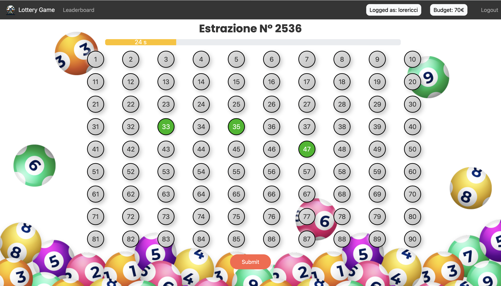
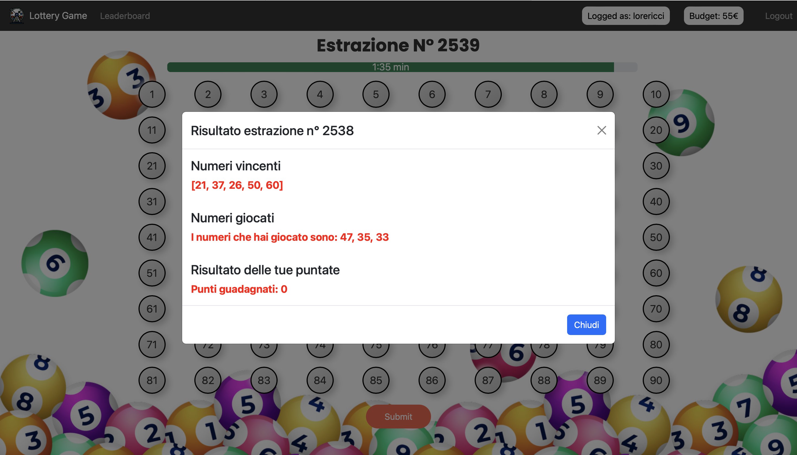

# 🎰 Lotto Istantaneo

## React Client Application Routes

- Route `/home`: contiene la schermata iniziale con il titolo del gioco e un pulsante gioca che ti porta alla schermata di login.

- Route `/login`: contiene il form per il login e le istruzioni del gioco.

- Route `/game`: contiene la pagina dell'estrazione con i numeri da puntare, il timer e un pulsante `leaderboard` che permette di visualizzare la classifica dei tre utenti con più budget.

- Route `/leaderboard`: contiene la classifica con i tre utenti con più budget insieme ad un pulsante `play` che permette di tornare alla pagina dell'estrazione.

- Route `*`: rappresenta tutte le route invalide.

## API Server

### __Ottieni le Informazioni Utente__

URL: `/api/lottery/:userId`

Metodo HTTP: GET.

Descrizione: Prende tutte le informazioni associate ad un utente rappresentato da `:userId`

Risposta: `200 OK` (success), `404 Not Found` (wrong id), or `500 Internal Server Error` (generic error).

Corpo della risposta:
```
{
  "id": 1,
  "username": "lorericci",
  "budget": 75,
}
```

### __Inserisco la Puntata dell'Utente__

URL: `/api/lottery/submit`

Metodo HTTP: POST.

Descrizione: Costruisco la puntata dell'utente e la inserisco all'interno del database.

Risposta: `200 OK` (success), `400 Bad Request` (error params, insufficient budget), `404 Not Found` (table not found) or `500 Internal Server Error` (generic error).

Corpo della risposta:
```
{
  true
}
```

### __Ottieni la Classifica__

URL: `/api/lottery/leaderboard`

Metodo HTTP: GET.

Descrizione: Ottengo la classifica dei tre utenti che hanno il valore di budget più alto.

Risposta: `200 OK` (success), `404 Users not Found` (empty users table), or `500 Internal Server Error` (generic error).

Corpo della risposta:
```
[
  {
  "id": 1,
  "username": "leino96",
  "budget": 100,
  }
  {
  "id": 0,
  "username": "lorericci",
  "budget": 75,
  }
  {
  "id": 2,
  "username": "silvestri",
  "budget": 50,
  }
]
```

### __Ottengo l'Estrazione Corrente__

URL: `/api/lottery`

Metodo HTTP: GET.

Descrizione: Ottengo tutte le informazioni riguardanti l'estrazione in corso: numero estrazione `num`, valore del timer lato server `timer`, stato dell'estrazione `state`.

Risposta: `200 OK` (success), `404 Lottery Draw not Found` (empty lottery_draws table), or `500 Internal Server Error` (generic error).

Corpo della risposta:
```
{
  "num": 126,
  "timer": 26,
  "state": "CREATED",
}
```

### __Ottengo Informazioni sulla Puntata dell'Utente__

URL: `/api/lottery/:num/:userId`

Metodo HTTP: GET.

Descrizione: Ottengo le informazioni riguardanti la puntata dell'utente, identificato con `userId`, per l'estrazione, identificata con `num`, insieme ai numeri puntati (se esiste la puntata).

Risposta: `200 OK` (success) or `500 Internal Server Error` (generic error).

Corpo della risposta:
```
{
  "numbers_played": [45, 3, 5]
  "isBet": true
}
```
oppure (se la puntata non esiste):
```
{
  "numbers_played": []
  "isBet": false
}
```

### __Ottengo il Risultato dell'Estrazione__

URL: `/api/lottery/result/:userId`

Metodo HTTP: GET.

Descrizione: Ottengo tutte le informazioni riguardanti il risultato dell'estrazione precedente fatta dall'utente identificato con `userId`: numero estrazione `num`, valore del timer lato server `timer`, numeri vincenti `winning_numbers`, stato dell'estrazione `state`, punti vinti `points_won` e i numeri puntati `numbers_played`.

Risposta: `200 OK` (success), `404 Lottery Draw not Found` (empty lottery_draws table), or `500 Internal Server Error` (generic error).

Corpo della risposta:
```
{
  "num": 125,
  "timer": 118,
  "winning_numbers": [4, 25, 37],
  "state": "FINAL",
  "points_won": 10,
  "numbers_played": [25, 32, 90]
}
```

### __Ottengo la Sessione Corrente dell'Utente__

URL: `/api/session/current`

Metodo HTTP: GET.

Descrizione: Ottiene le informazioni dell'utente autenticato nella sessione corrente.

Risposta:  `200 OK` (success), `401 Not Authenticated` (user not authenticated)

Corpo della Risposta:
```
{
  "id": 0,
  "username": "lorericci",
  "budget": 75,
}
```

### __Effettua il Login dell'Utente__

URL: `/api/sessions`

Metodo HTTP: POST.

Descrizione: Esegue l'autenticazione dell'utente, restituendo le sue informazioni.

Risposta: `201 Created` (login success) or `401 Unauthorized` (login failed).

Corpo della Risposta:
```
{
  "id": 0,
  "username": "lorericci",
  "budget": 75,
}
```

### __Effettua il Logout dell'Utente__

URL: `/api/sessions/current`

Metodo HTTP: DELETE.

Descrizione: Termina la sessione dell'utente attualmente autenticato.

Risposta: `200 OK` (logout success).

Corpo della Risposta: `None`

## Database Tables

- Table `users` - contiene `id` `username` `password` `salt` `budget`. Tabella che contiene gli utenti registrati.

- Table `lottery_draws` - contiene `num` `winning_numbers` `state`. Tabella che contiene tutte le estrazioni passate e in corso.

- Table `bets` - contiene `id` `userId` `lotteryDraw_number` `num1` `num2` `num3` `result`. Tabella che contiene le informazioni sulle puntate fatte dagli utenti per una determinata estrazione, insieme al punteggio che hanno guadagnato in quest'ultima.

## Main React Components

- `Home` (in `Home.jsx`): questo componente ha lo scopo di mostrare il titolo del gioco e di cosa tratta. Le funzioni principali sono esclusivamente visive con un bottone `Gioca` per passare alla route successiva.

- `NavHeader` (in `NavHeader.jsx`): Questo componente è presente in tutte le Route dell'applicazione e ha uno scopo diverso per ogni route:
  - `/home`: contiene solo il titolo del gioco
  - `/login`: è uguale a sopra
  - `/game`: contiene, oltre al titolo del gioco, un pulsante che porta alla pagina della classifica, username e budget dell'utente loggato e il pulsante di logout.
  - `/leaderboard`: contiene il pulsante per tornare alla pagina del gioco e il pulsante di logout.

- `LoginForm` (in `AuthComponents.jsx`): contiene le regole del gioco e il form di login per accedere all'estrazione in corso.

- `GameProvider` (in `GameContext.jsx`): è un componente speciale che avvolge l'intera applicazione e ha lo scopo di fornire i dati del contesto globale `GameContext` a tutti i componenti figli.

- `Game` (in `Game.jsx`): è il componente più importante dell'applicazione. Contiene l'estrazione in corso, il tempo che rimane all'estrazione e i numeri con cui poter effettuare la puntata.

- `LeaderBoard` (in `Leaderboard.jsx`): contiene la classifica composta dai tre utenti con il budget più alto.

- `NotFoundComponent` (in `NotFoundComponents.jsx`): contiene una scritta che mostra che la route non esiste.

## Screenshot

#### Fase di Puntata


#### Estrazione dei numeri


## Users Credentials

- username: lorericci, password: testtest 
- username: leino96, password: test 
- username: bluesea99, password: garen
- username: marco, password: pass
- username: giorgia, password: silv